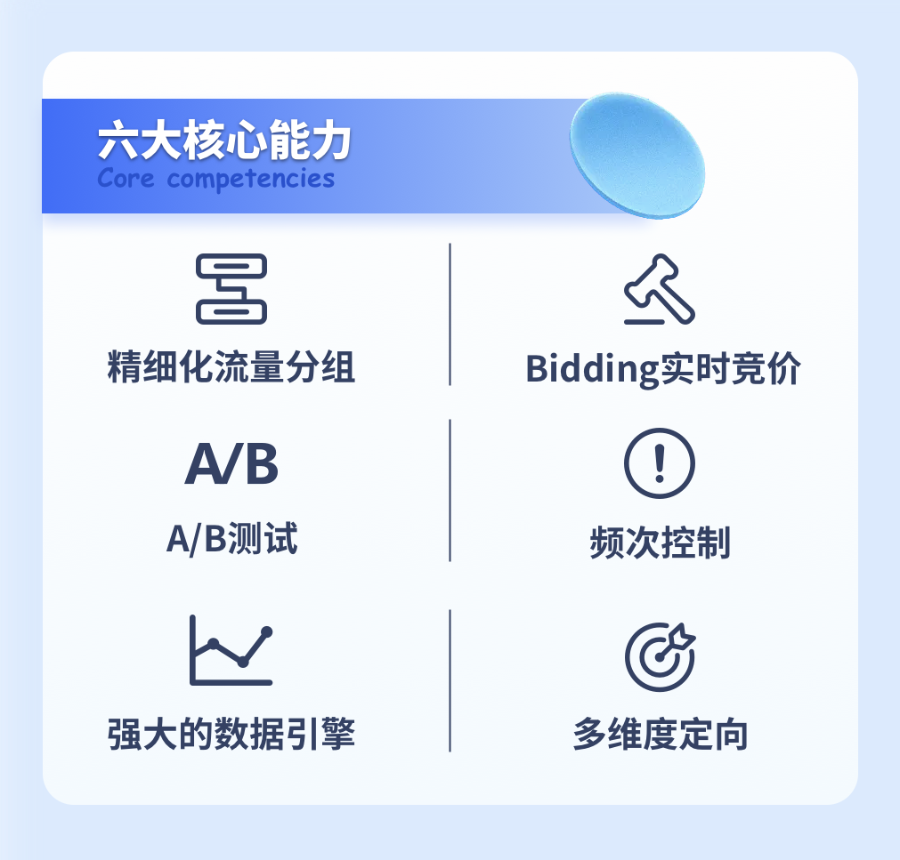

# EasyAds Pro

**智能聚合 极速变现 专业私有 卓越升级**

## 项目简介

欢迎大家使用**EasyAds Pro**

EasyAds Pro是[倍业科技](http://www.bayescom.com/)技术团队研发的一款开源聚合SDK管理项目，项目包括了聚合SDK、聚合管理平台、SDK策略服务和数据服务四大模块；旨在帮助APP开发者快速搭建属于自己的聚合SDK管理系统，赋能开发者流量变现能力。

## 六大核心能力

## 项目优势

### 1. 流量管理方便快捷

支持实时竞价；提供多个维度对用户进行分组，开发者可根据需要选择分组的维度，并针对不同流量分组配置不同的瀑布流；可设置最多10个分组进行A/B测试，帮助开发者寻求流量变现最优解。

### 2. 集成简单

双端均可通过选择性的配置装载不同广告渠道SDK快速集成。开发者无须进行二次开发，直接调用EasyAds Pro SDK封装的上层接口即可；前台系统可直接复用EasyAds Pro前台系统。目前已集成主流的[穿山甲(字节)](https://www.csjplatform.com/union/media/union/download)、[优量汇(腾讯)](https://adnet.qq.com/resource/sdk)、
[百青藤(百度)](https://union.baidu.com/bqt/#/)、[快手](https://u.kuaishou.com/)，开发者也可以通过自定义SDK渠道来实现其他广告SDK的对接管理。

### 3. 开源，免费，安全

项目完全开源，不进行任何用户相关信息的获取及上报，开发者可根据自己业务需求进行二次开发。

## 快速接入指引

| 系统     | 代码指引                                                                                                                                                                                                                                                                    |
|-------- |-------------------------------------------------------------------------------------------------------------------------------------------------------------------------------------------------------------------------------------------------------------------------|
| iOS     |                             |
| Android |     |
| Apollo | 

## 技术支持

QQ群：

QQ群二维码：

邮件技术支持：<easyads@bayescom.com>

## 更多
**倍业科技**，是一家赋能各领域媒体商业化的SaaS服务型企业，通过智能高效的流量管理和运营优化工具，为媒体充分挖掘每个流量的价值。
如果你有更高级的变现需求，欢迎与我们联系。

商务合作：<partner@bayescom.com>
